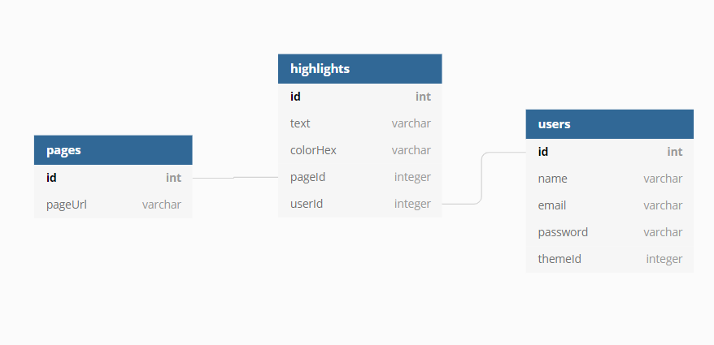

<h1>데이터 베이스</h1> 

<h2>DB 설계 근거</h2>

  Users Table: 유저의 정보를 관리하기 위한 테이블 
  Pages Table: 페이지의 정보를 페이지 기반으로 저장하기 위한 테이블 
  Highlights Table: 유저의 하이라이트, 하이라이트가 쓰인 페이지의 정보를 저장하고 읽기 위한 테이블

<h2>관계 근거</h2>

<h3>users > highlights(1대N)</h3>

- 유저가 사용한 하이라이트의 정보를 불러내기위해 사용 
- 하이라이트는 유저가 사용하지 않으면 존재할 수 없음

<h3>pages > highlights(1대N)</h3>

- 유저가 사용한 하이라이트가 페이지 내에서 몇개 있는지 확인 하기 위해 사용
- 하이라이트는 페이지가 없으면 존재할 수 없음

<h2>ERD</h2>

<h1>Apis</h1>
<ul>
	<li>createHighlight: 하이라이트 저장</li>
	<li>updateHighlight: 하이라이트 수정</li>
	<li>readPageInHighlights: 페이지 내 하이라이트 정보 가져오기</li>
	<li>readPagesOrHighlights: 유저가 하이라이트한 정보와 페이지 가져요기</li>
	<li>deleteHighlight: 하이라이트 삭제</li>
	<li>updateTheme: 유저의 하이라이트 테마 변경</li>
	</ul>

### 확인해야 할 사항
 모든 api는 Authorization 헤더안에 access_token을 넣어야 합니다. 
 ex) .set(Authorization, access_token) 
 user의 기본 themeId 는 1로 설정되어 있습니다.

<h1>helpFunction</h1>
  authOrHandling: 반복되는 에러 핸들링, 토큰인증(블랙리스트, access_token확인등)을 위해 사용 
  getThemes: themeId에 맞는 themes를 가져오기 위해 사용 

<h1>auth</h1>
  - signup, signin, signout  
  - refresh : access_token이 만료 되었을때 refhresh_token을 통해 재발급하기 위해 사용  

### 확인해야 할 사항
refresh api는 Authorization 헤더 안에 refresh_token을 넣어야 합니다.
